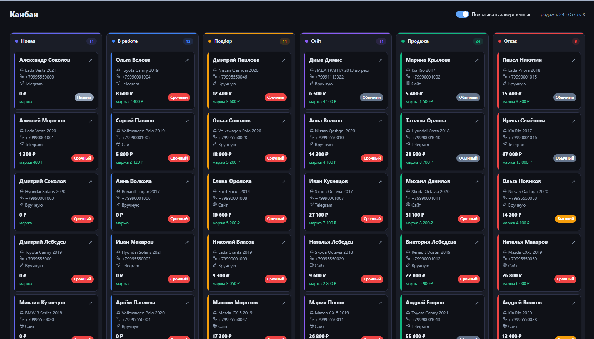
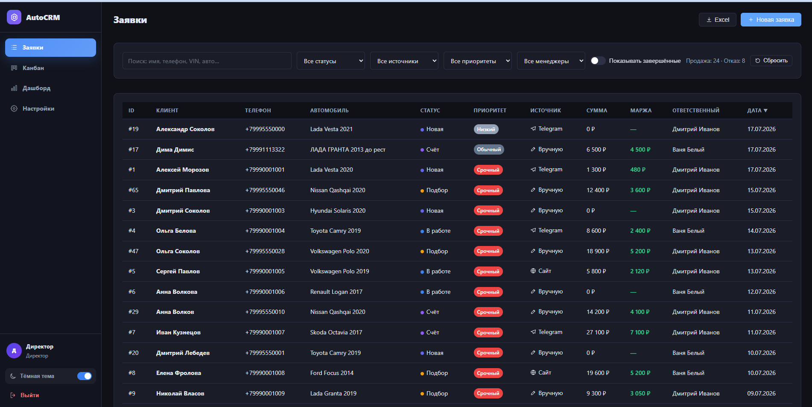
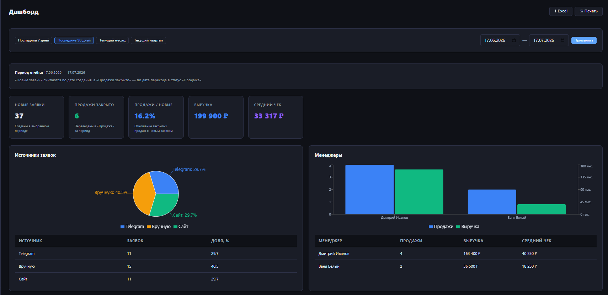
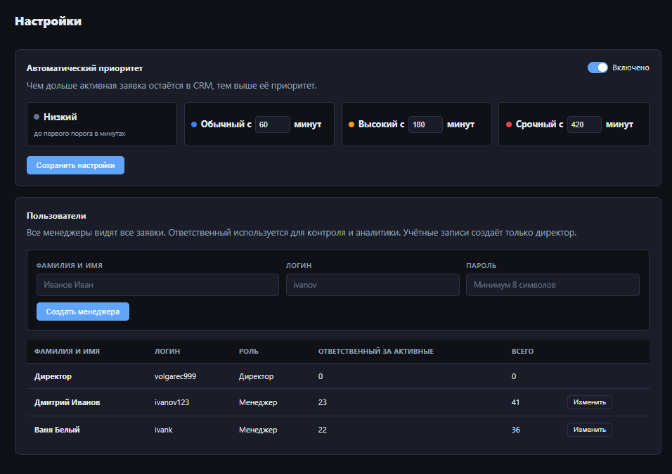
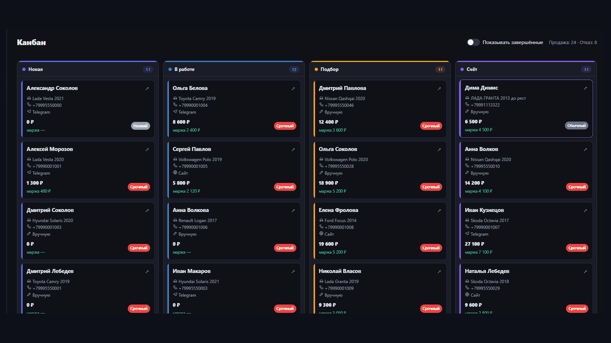

# 🚗 AutoCRM — CRM-система для магазина автозапчастей

[](https://github.com/yatochkaa/autocrm/actions/workflows/ci.yml)


AutoCRM ведёт заявки магазина автозапчастей от первого обращения до продажи. В системе есть реестр заявок, Kanban-воронка, подбор позиций, роли сотрудников, аудит, аналитика и настоящий экспорт XLSX.

**Воронка:** `Новая → В работе → Подбор → Счёт → Продажа / Отказ`

> Публичная демо-версия пока не опубликована. Инструкция по развёртыванию находится в [docs/DEPLOY.md](docs/DEPLOY.md).

## 📸 Интерфейс

| Kanban | Заявки |
|---|---|
|  |  |

| Dashboard | Настройки |
|---|---|
|  |  |



## ✨ Возможности

- реестр заявок с поиском, фильтрами, приоритетами и сохранением состояния;
- Kanban drag-and-drop с правилами воронки и историей статусов;
- позиции заказа, OEM, оригиналы/аналоги, сумма и маржа;
- роли директора и менеджеров, управление учётными записями;
- комментарии и audit log;
- аналитика продаж, источников, менеджеров и времени этапов;
- экспорт заявок и отчётов в настоящий `.xlsx`;
- светлая/тёмная темы и печатный A4-отчёт;
- Docker Compose и CI для backend/frontend.

## 🛠 Стек

| Слой | Технологии |
|---|---|
| Backend | Python 3.12, FastAPI, SQLAlchemy 2.0 async, Alembic, Pydantic v2 |
| БД | PostgreSQL 16, asyncpg, psycopg3 |
| Auth | JWT, passlib, bcrypt |
| Frontend | React 18, TypeScript, Vite, React Router, Recharts, dnd-kit |
| Тесты | pytest-asyncio, SQLite in-memory локально, PostgreSQL в CI |

## 🚀 Быстрый запуск

```bash
git clone https://github.com/yatochkaa/autocrm.git
cd autocrm
cp .env.example .env
# обязательно замените SECRET_KEY и SEED_*_PASSWORD
docker compose up --build
```

После запуска:

- Frontend: http://localhost:5173
- API: http://localhost:8000
- Swagger: http://localhost:8000/docs

Демо-данные:

```bash
docker compose exec api python -m app.seed
docker compose exec api python -m scripts.seed_portfolio --count 60
```

Логины и пароли задаются только через переменные `SEED_*` в локальном `.env` и не публикуются в репозитории.

## 🧪 Проверки

```bash
pip install -r requirements-dev.txt
ruff check app tests scripts
pytest -q
cd frontend
npm ci
npm run build
```

Локальные backend-тесты по умолчанию используют SQLite in-memory. PostgreSQL используется в CI и интеграционном окружении.

## 🏗 Архитектура

```text
app/
├── api/            # FastAPI routes и зависимости
├── core/           # config, database, JWT, runtime settings, user profiles
├── db/             # SQLAlchemy ORM и enums
├── domain/         # правила воронки и предметной области
├── repositories/   # доступ к данным
├── schemas/        # Pydantic-схемы
├── services/       # бизнес-логика, аналитика, XLSX
└── main.py         # фабрика приложения
frontend/           # React + TypeScript + Vite
scripts/            # безопасные служебные и seed-скрипты
tests/              # pytest
alembic/            # миграции
```

Runtime-файлы `autocrm_user_profiles.json` и `autocrm_settings.json` создаются приложением локально и не хранятся в Git.

## 🌐 Деплой

Пошаговая инструкция: [docs/DEPLOY.md](docs/DEPLOY.md).

## 🗺 Roadmap

- [x] Kanban и история статусов
- [x] роли директора/менеджеров
- [x] комментарии и audit log
- [x] аналитика и Dashboard
- [x] экспорт XLSX
- [x] CI backend/frontend
- [ ] Telegram-бот
- [ ] интеграция с поставщиками
- [ ] уведомления

## 📄 Лицензия

[MIT](LICENSE)
