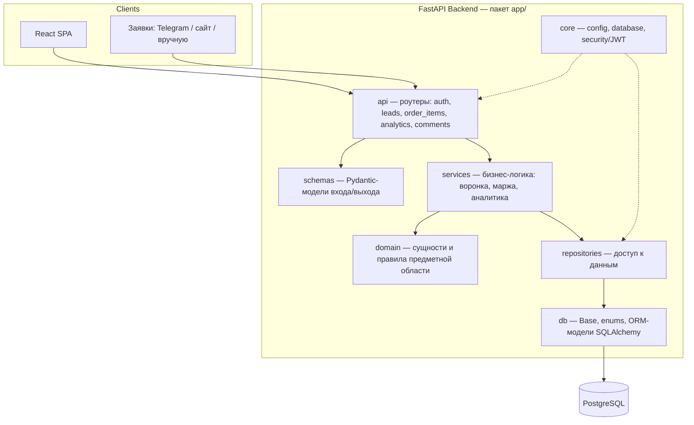
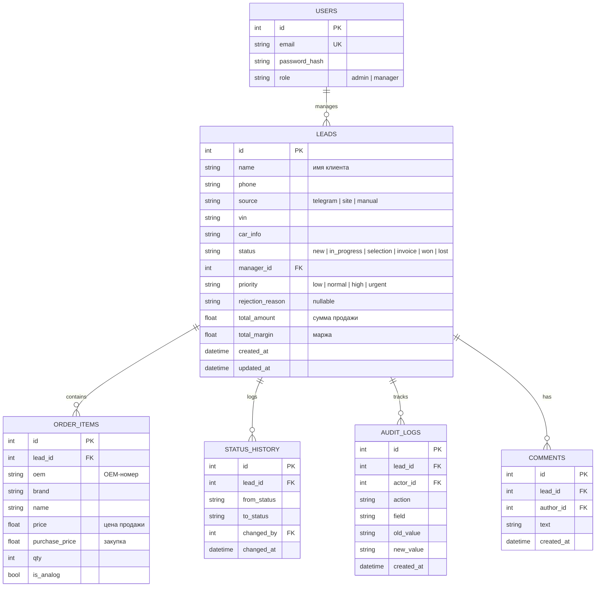
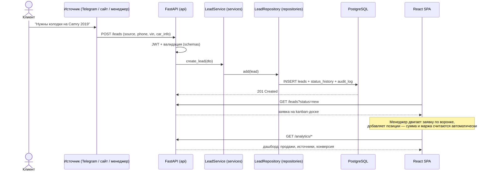

# 🚗 AutoCRM — CRM для магазина автозапчастей

[](https://github.com/yatochkaa/autocrm/actions/workflows/ci.yml)


CRM-система для магазина автозапчастей: заявки клиентов (источники —
Telegram / сайт / вручную) ведутся менеджером по воронке продаж, по каждой
заявке подбираются запчасти (оригиналы и аналоги), считаются **сумма и
маржа**, а аналитика выводится на **дашборд**.

**Воронка:** `Новая → В работе → Подбор → Счёт → Продажа / Отказ`

🔗 **Live demo:** https://autocrm-demo.up.railway.app · **Swagger:** https://autocrm-demo.up.railway.app/docs

> Демо-доступ: `manager@autocrm.local` / `manager123`

---

## 📸 Скриншоты

<!-- TODO: добавить реальные скриншоты/GIF в docs/screenshots/ -->

| Воронка (kanban) | Карточка заявки | Дашборд |
|---|---|---|
|  |  |  |

---

## ✨ Возможности

- 🧭 Kanban-воронка заявок с drag-and-drop (@dnd-kit) и историей смены статусов
- 🔧 Позиции подбора: OEM-номера, бренды, оригинал/аналог, цена и закупка
- 💰 Авторасчёт: `line_total = price × qty`, `line_margin = (price − purchase_price) × qty`
- 📊 Аналитика: продажи, источники, менеджеры, конверсия по этапам (Recharts)
- 🔐 JWT-авторизация, роли admin/manager, приоритеты и причины отказа
- 📝 Комментарии к заявкам и полный audit log действий
- 🧪 CI: ruff + проверка миграций + pytest на каждый push

## 🛠 Стек

| Слой | Технологии |
|---|---|
| Backend | Python 3.12, FastAPI, SQLAlchemy 2.0 (async), Alembic, Pydantic v2 |
| БД | PostgreSQL 16 (asyncpg / psycopg3) |
| Auth | JWT (PyJWT), passlib + bcrypt |
| Frontend | React 18, TypeScript, Vite, React Router, Recharts, @dnd-kit |
| Инфраструктура | Docker, docker-compose (db + api + frontend), GitHub Actions |
| Тесты | pytest (async), ruff |

---

## 🚀 Quickstart

Нужны только Docker и docker compose:

```bash
git clone https://github.com/yatochkaa/autocrm.git
cd autocrm
cp .env.example .env

docker compose up --build
```

После запуска:

| Сервис | URL |
|---|---|
| Frontend | http://localhost:5173 |
| API | http://localhost:8000 |
| Swagger UI | http://localhost:8000/docs |

Наполнить базу демо-данными:

```bash
# пользователи (admin + manager) и несколько демо-заявок
docker compose exec api python -m app.seed

# ~60 реалистичных заявок с историей статусов для дашборда
docker compose exec api python -m scripts.seed_portfolio --count 60
```

Логин: `manager@autocrm.local` / `manager123` (переопределяется через `SEED_*` в `.env`).

Тесты (локально, нужен запущенный PostgreSQL — см. `.github/workflows/ci.yml`):

```bash
pip install -r requirements-dev.txt
pytest -q
```

---

## 🏗 Architecture

Слоистая архитектура — каждый слой знает только о слое ниже:



### Структура проекта

```
autocrm/
├── app/
│   ├── api/            # роутеры FastAPI + зависимости
│   ├── core/           # конфиг, подключение к БД, JWT/security
│   ├── db/             # Base, enums, ORM-модели
│   ├── domain/         # доменные сущности и правила
│   ├── repositories/   # доступ к данным
│   ├── schemas/        # Pydantic-схемы
│   ├── services/       # бизнес-логика
│   ├── main.py         # фабрика приложения
│   └── seed.py         # сид: пользователи + демо-заявки
├── alembic/            # миграции БД
├── frontend/           # React + TypeScript + Vite
├── scripts/            # seed_portfolio.py и утилиты
├── tests/              # pytest
├── docker-compose.yml  # db + api + frontend
└── Dockerfile          # образ API
```

### Схема БД



### Путь заявки (sequence)



---

## 🌐 Деплой

Проект разворачивается на [Railway](https://railway.app) (PostgreSQL + API + frontend).
Пошаговая инструкция: [docs/DEPLOY.md](docs/DEPLOY.md).

## 🗺 Roadmap

- [x] Воронка заявок с kanban и историей статусов
- [x] Позиции подбора (оригинал/аналог) с расчётом суммы и маржи
- [x] JWT-авторизация, роли admin/manager
- [x] Аналитика и дашборд
- [x] Комментарии и audit log
- [x] CI (ruff + миграции + pytest)
- [ ] Telegram-бот для автоматического приёма заявок
- [ ] Экспорт отчётов в Excel/CSV
- [ ] Интеграция с поставщиками (проценка по API)
- [ ] Уведомления менеджеру о новых заявках

## 📄 Лицензия

MIT
